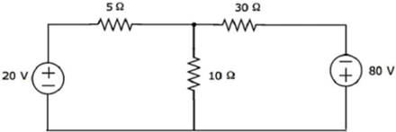
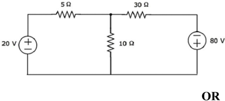
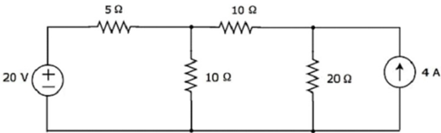

## GUJARAT TECHNOLOGICAL UNIVERSITY DIPLOMA IN ENGINEERING - SEMESTER - III EXAMINATION - WINTER 2025

Subject Code: DI03011031

Date: 15-12-2025

Subject Name: Electronics Circuit Network &amp; Measurement

Time: 10:30 AM TO 01:00 PM

Total Marks: 70

Instructions:

1. Attempt all questions.
2. Make Suitable assumptions wherever necessary.
3. Figures to the right indicate full marks.
4. Use of simple calculators and non-programmable scientific calculators are permitted.
5. English version is authentic.

Q.1

(a)

Define: 1) Active Elements, 2) Passive Elements, 3) Bilateral Elements

- ( અ ) GLYPH&lt;c=2,font=/QGCAAA+Lohit-Gujarati&gt; યાGLYPH&lt;c=5,font=/QGCAAA+Lohit-Gujarati&gt;યાયીત કરો : 1) સિGLYPH&lt;c=13,font=/QGCAAA+Lohit-Gujarati&gt;ય તGLYPH&lt;c=14,font=/QGCAAA+Lohit-Gujarati&gt;વો , 2) િનિGLYPH&lt;c=17,font=/QGCAAA+Lohit-Gujarati&gt;GLYPH&lt;c=13,font=/QGCAAA+Lohit-Gujarati&gt;ય તGLYPH&lt;c=14,font=/QGCAAA+Lohit-Gujarati&gt;વો , 3) િGLYPH&lt;c=18,font=/QGCAAA+Lohit-Gujarati&gt;પGLYPH&lt;c=20,font=/QGCAAA+Lohit-Gujarati&gt;ીય તGLYPH&lt;c=14,font=/QGCAAA+Lohit-Gujarati&gt;વો
- (b) Explain Z (Open circuit Impedance) Parameter and derive its equations
- ( બ ) Z ( ઓપન સGLYPH&lt;c=25,font=/QGCAAA+Lohit-Gujarati&gt;કટ ઇGLYPH&lt;c=28,font=/QGCAAA+Lohit-Gujarati&gt;પીડ GLYPH&lt;c=31,font=/QGCAAA+Lohit-Gujarati&gt;સ ) પ રમાણ સમ#વો અને તેના સમીકરણો મેળવો

ે

- (c) Explain Mesh Analysis using suitable diagram with required equations and find the voltage across 30Ω resistor for bellow figure
- ( ક ) જ'રી સમીકરણો સાથે યો)ય આકૃ￵તનો ઉપયોગ કરીને મેશ િવ0ેષણ સમ#વો અને નીચેની આકૃ￵ત માટે 30Ω રે િઝ4ટર પર વો5ટેજ શોધો
- (c) Explain Node Analysis using suitable diagram with required equations and find current flowing through 20Ω resistor for bellow figure

Marks

03

૦૩

04

૦૪

07

૦૭

07

- ( ક ) યો)ય આકૃ￵તનો ઉપયોગ કરીને જ'રી સમીકરણો સાથે નોડ િવ0ેષણ સમ#વો અને નીચે આપેલા આકૃ￵ત માટે 20Ω રે િઝ4ટરમાંથી વહેતો ;વાહ શોધો
- Q.2 (a) Explain Q-factor and derive the equation of Quality factor Q for a coil (Inductor)
- ( અ ) Qપ રબળ સમ#વો અને કોઇલ ( ઇGLYPH&lt;c=31,font=/QGCAAA+Lohit-Gujarati&gt;ડ&lt;ટર ) માટે ગુણવ&gt;ા પ રબળ Q નું સમીકરણ મેળવો
- (b) Explain constant-K Low Pass Filter and derived equation of cutoff frequency
- ( બ ) કોGLYPH&lt;c=31,font=/QGCAAA+Lohit-Gujarati&gt;4ટGLYPH&lt;c=31,font=/QGCAAA+Lohit-Gujarati&gt;ટ -k લો પાસ િફ5ટર અને કટઓફ @ી&lt;વGLYPH&lt;c=31,font=/QGCAAA+Lohit-Gujarati&gt;સીના GLYPH&lt;c=2,font=/QGCAAA+Lohit-Gujarati&gt; યુGLYPH&lt;c=14,font=/QGCAAA+Lohit-Gujarati&gt;પA સમીકરણ સમ#વો
- (c) Discuss series R-L-C circuit and derive equation of series resonance frequency. Why Series resonance RLC circuit is called as voltage magnification?
- ( ક ) Bેણી R-L-C સGLYPH&lt;c=25,font=/QGCAAA+Lohit-Gujarati&gt;કટની ચચાC કરો અને Bેણી રે ઝોનGLYPH&lt;c=31,font=/QGCAAA+Lohit-Gujarati&gt;સ @ી&lt;વGLYPH&lt;c=31,font=/QGCAAA+Lohit-Gujarati&gt;સીનું સમીકરણ મેળવો. Bેણી રે ઝોનGLYPH&lt;c=31,font=/QGCAAA+Lohit-Gujarati&gt;સ RLC સGLYPH&lt;c=25,font=/QGCAAA+Lohit-Gujarati&gt;કટને વો5ટેજ મેિEિફકેશન કે મ કહેવામાં આવે છે ?

## OR

- (a) Explain Q-factor and derive equation of Q factor for capacitor
- ( અ ) Qપ રબળ સમ#વો અને કે પેસટર માટે Q પ રબળનું સમીકરણ મેળવો
- (b) Compare LPF, HPF, BPF and BSF
- ( બ ) LPF, HPF, BPF અને BSF ની તુલના કરો
- (c) Discuss parallel R-L-C circuit and derive equation of parallel resonance frequency. Why parallel resonance RLC circuit is called as current magnification?
- ( ક ) સમાંતર R-L-C સGLYPH&lt;c=25,font=/QGCAAA+Lohit-Gujarati&gt;કટની ચચાC કરો અને સમાંતર રે ઝોનGLYPH&lt;c=31,font=/QGCAAA+Lohit-Gujarati&gt;સ @ી&lt;વGLYPH&lt;c=31,font=/QGCAAA+Lohit-Gujarati&gt;સીનું સમીકરણ મેળવો. સમાંતર રે ઝોનGLYPH&lt;c=31,font=/QGCAAA+Lohit-Gujarati&gt;સ RLC સGLYPH&lt;c=25,font=/QGCAAA+Lohit-Gujarati&gt;કટને કરં ટ મેિEિફકેશન કે મ કહેવામાં આવે છે ?
- Q.3 (a) Define: (1) Error, (2) Repeatability, (3) Sensitivity
- ( અ ) GLYPH&lt;c=2,font=/QGCAAA+Lohit-Gujarati&gt; યાGLYPH&lt;c=5,font=/QGCAAA+Lohit-Gujarati&gt;યાિયત કરો : (1) GLYPH&lt;c=20,font=/QGCAAA+Lohit-Gujarati&gt;￵ત , (2) પુનરાવ￳તતતા , (3) સંવેદનશીલતા
- (b) State application, advantages, disadvantages and limitation of Maxwell's bridge
- ( બ ) મે&lt;સવેલના �Kજના ઉપયોગ , ફાયદા , ગેરફાયદા અને મયાCદાઓ જણાવો
- (c) Explain working of Wheatstone bridge with circuit diagram and derive equation for balanced condition
- ( ક ) સGLYPH&lt;c=25,font=/QGCAAA+Lohit-Gujarati&gt;કટ ડાયાLામ વડે GLYPH&lt;c=2,font=/QGCAAA+Lohit-Gujarati&gt; હીટ4ટોન �Kજનું કાયC સમ#વો અને સંતુિલત િ4થ￵ત માટે સમીકરણ મેળવો

## OR

- (a) Compare AC and DC Bridge
- ( અ ) એસી અને ડીસી �Kજની સરખામણી કરો
- (b) State application, advantages, disadvantages and limitation of Schering Bridge
- ( બ ) શેરOગ �Kજના ઉપયોગ , ફાયદા , ગેરફાયદા અને મયાCદાઓ જણાવો

૦૭

03

૦૩

04

૦૪

07

૦૭

03

૦૩

04

૦૪

07

૦૭

03

૦૩

04

૦૪

07

૦૭

03

૦૩

04

૦૪

R

|     | (c)   | Explain working of Maxwell's bridge with circuit diagram for balance condition                                                                               | 07   |
|-----|-------|--------------------------------------------------------------------------------------------------------------------------------------------------------------|------|
|     | ( ક ) | સંતુલનની િ4થ￵ત માટે સGLYPH<c=25,font=/QGCAAA+Lohit-Gujarati>કટ ડાયાLામ સાથે મે<સવેલના �Kજનું કાયC સમ#વો                                                                        | ૦૭   |
| Q.4 | (a)   | Differentiate between moving iron and moving coil type instruments                                                                                           | 03   |
|     | ( અ ) | મૂQવગ આયનC અને મૂQવગ કોઇલ ;કારના ઇGLYPH<c=31,font=/QGCAAA+Lohit-Gujarati>4ટ મેGLYPH<c=31,font=/QGCAAA+Lohit-Gujarati>ટ વSચેનો તફાવત આપો                                 | ૦૩   |
|     | (b)   | Describe Norton Theorem using suitable diagram with required equations                                                                                       | 04   |
|     | ( બ ) | જ'રી સમીકરણો સાથે યો)ય આકૃ￵તનો ઉપયોગ કરીને નોટCન ;મેયનું વણCન કરો                                                                                                            | ૦૪   |
|     | (c)   | Explain working of Digital Voltmeter (DVM) with necessary diagram                                                                                            | 07   |
|     | ( ક ) | જ'રી આકૃ￵ત સાથે િડિજટલ વો5ટમીટર  (DVM)  નું કાયC સમ#વો                                                                                                                   | ૦૭   |
|     |       | OR                                                                                                                                                           |      |
|     | (a)   | Explain working of electronic Multimeter with necessary diagram                                                                                              | 03   |
|     | ( અ ) | જ'રી આકૃ￵ત સાથે ઇલે<ટTોિનક મિ5ટમીટરનું કાયC સમ#વો                                                                                                                         | ૦૩   |
|     | (b)   | State and explain Maximum power transfer theorem. Derive condition for maximum power transfer                                                                | 04   |
|     | ( બ ) | મહ>મ પાવર ટT ાGLYPH<c=31,font=/QGCAAA+Lohit-Gujarati>સફર ;મેય જણાવો અને સમ#વો. મહ>મ પાવર ટT ાGLYPH<c=31,font=/QGCAAA+Lohit-Gujarati>સફર માટે િ4થ￵ત શોધો                    | ૦૪   |
|     | (c)   | Describe Construction, Block diagram, working and advantage of Digital storage oscilloscope (DSO)                                                            | 07   |
|     | ( ક ) | િડિજટલ 4ટોરેજ ઓસલો4કોપ  (DSO)  ની રચના ,  Uલોક ડાયાLામ ,  કાયC અને ફાયદાનું વણCન કરો                                                                                            | ૦૭   |
| Q.5 | (a)   | Discuss the principle of duality with suitable example                                                                                                       | 03   |
|     | ( અ ) | યો)ય ઉદાહરણ સાથે ડયુંલના સVાંતની ચચાC કરો                                                                                                                                | ૦૩   |
|     | (b)   | Describe Thermocouple with working principle, types and application                                                                                          | 04   |
|     | ( બ ) | કાયCકારી સVાંત ,  ;કારો અને ઉપયોગ સાથે થમWકપલનું વણCન કરો                                                                                                                  | ૦૪   |
|     | (c)   | Explain LVDT Transducer operation, construction with necessary diagram in detail. Also list its advantage, disadvantage and application                      | 07   |
|     | ( ક ) | LVDT  ટT ાGLYPH<c=31,font=/QGCAAA+Lohit-Gujarati>સXુસરનું સંચાલન ,  બાંધકામ જ'રી આકૃ￵ત સાથે િવગતવાર સમ#વો. તેના ફાયદા ,  ગેરફાયદા અને ઉપયોગની યાદી પણ આપો                                 | ૦૭   |
|     |       | OR                                                                                                                                                           |      |
|     | (a)   | Define Node, Branch, Mesh and Loop with suitable diagram                                                                                                     | 03   |
|     | ( અ ) | યો)ય આકૃ￵ત સાથે નોડ ,  KાGLYPH<c=31,font=/QGCAAA+Lohit-Gujarati>ચ ,  મેશ અને લૂપ GLYPH<c=2,font=/QGCAAA+Lohit-Gujarati> યાGLYPH<c=5,font=/QGCAAA+Lohit-Gujarati>યાિયત કરો | ૦૩   |
|     | (b)   | Describe Thermistor with working principle, characteristics and application                                                                                  | 04   |
|     | ( બ ) | થ￳મ4ટરનું કાયCકારી સVાંત ,  લાGLYPH<c=20,font=/QGCAAA+Lohit-Gujarati>િણકતાઓ અને ઉપયોગ સાથે વણCન કરો                                                                         | ૦૪   |
|     | (c)   | Explain RTD Transducer operation, construction with necessary diagram in detail. Also list its advantage, disadvantage and application                       | 07   |

- ( ક ) જ'રી આકૃ￵ત સાથે RTD ટT ાGLYPH&lt;c=31,font=/QGCAAA+Lohit-Gujarati&gt;સXુસરની કામગીરી , બાંધકામ િવગતવાર સમ#વો. તેના ફાયદા , ગેરફાયદા અને ઉપયોગની યાદી પણ આપો